# Лабораторная работа 3. Реализация серверной части на django rest. Документирование API

## Описание эндпоинтов
### School
#### Schedule
1 **Получить расписание**
```
GET /school/schedules
```
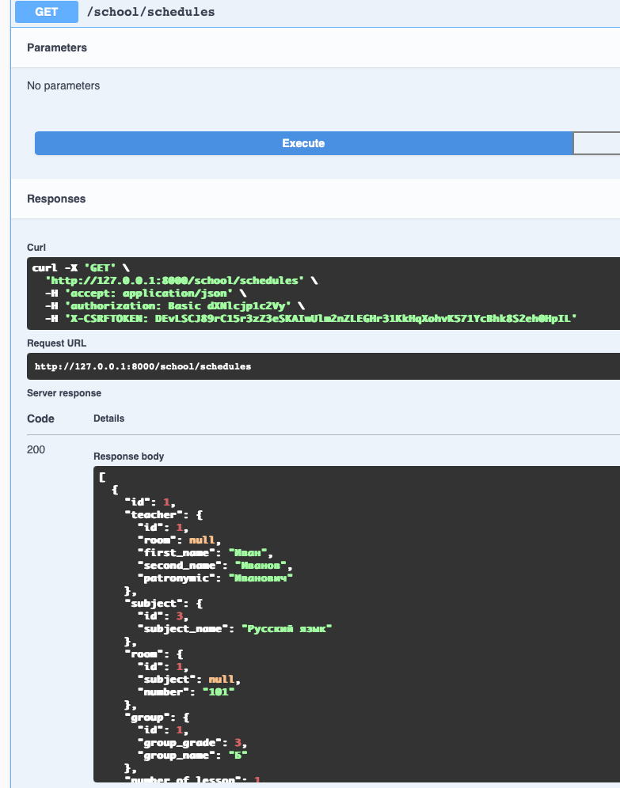
2 **Добавить расписание**

```
POST /school/schedules
```
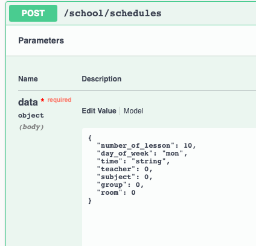

3 **Получить определённое расписание**
```
GET /school/schedules/{id}
```
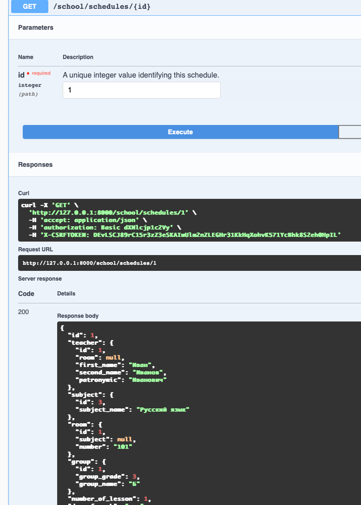
4 **Удалить расписание**
```
DELETE /school/schedules/{id}/delete
```
5 **Изменить расписание**
```
UPDATE /school/schedules/{id}/update
```
6 **Изменить расписание**
```
PATCH  /school/schedules/{id}/update
```
7 **Получить предмет, который будет преподаваться в определённом классе, в определённый день недели, на определённом уроке.**
```
GET /school/schedule/subject
```
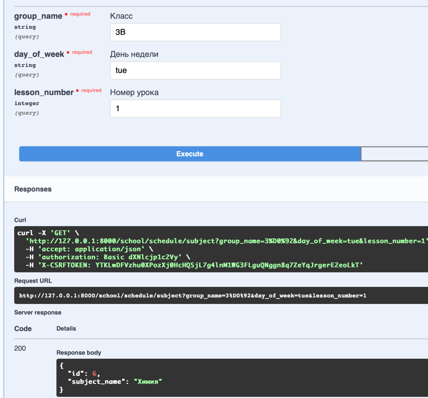
#### Students
8 **Получить список учеников**
```
GET /school/students
```
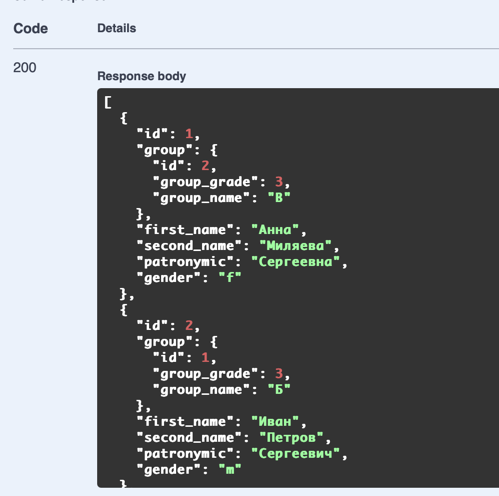
9 **Добавить ученика**
```
POST  /school/students
```
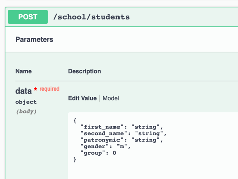
10 **Получить подробную информацию об ученике**
```
GET /school/students/{id}
```
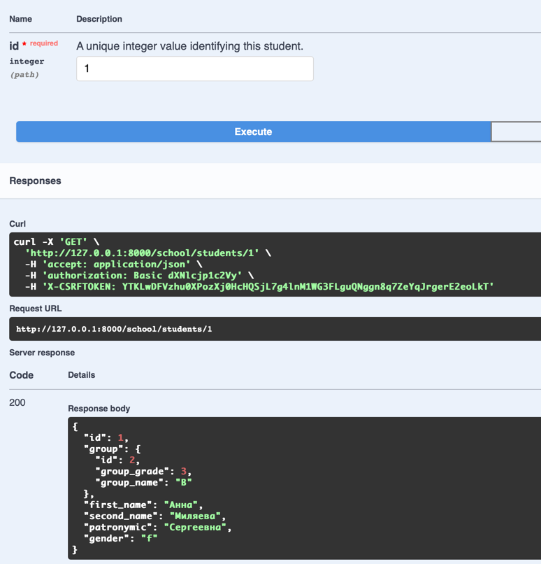
11 **Удалить ученика**
```
DELETE /school/students/{id}/delete
```
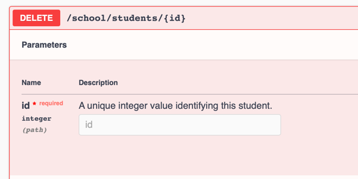
12 **Изменить данные об ученике**
```
UPDATE /school/students/{id}/update
```
13 **Изменить данные об ученике**
```
PATCH /school/students/{id}/update
```
14 **Получить информацию о количестве мальчиков и девочек в каждом классе**
```
GET /school/students/gender
```
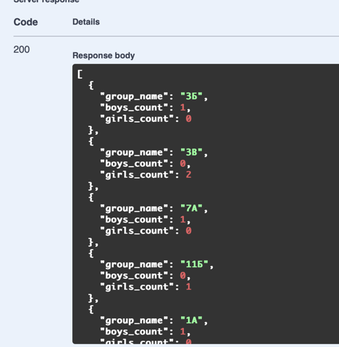
#### Teachers
15 **Получить список учителей**
```
GET /school/teachers
```
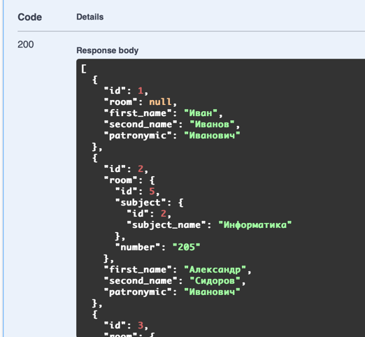
16 **Добавить учителя**
```
POST /school/teachers
```
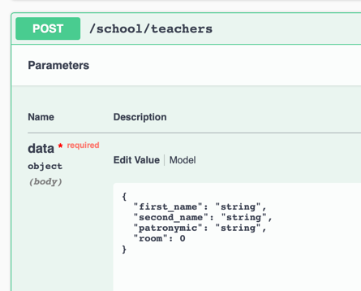
17 **Удалить учителя**
```
DELETE /school/teachers/{id}/delete
```
18 **Получить подробную информацию об учителе**
```
GET /school/teachers/{id}
```
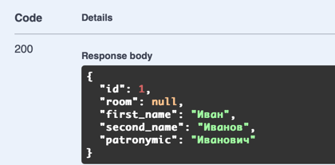
19 **Изменить данные об учителе**
```
UPDATE /school/teachers/{id}/update
```
20 **Изменить данные об учителе**
```
PATCH /school/teachers/{id}/update
```
21 **Получить список классных руководителей**
```
GET /school/teachers/home
```
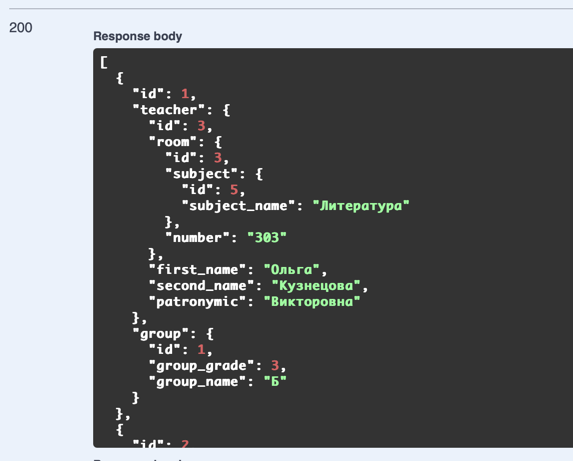
22 **Добавить классного руководителя**
```
POST /school/teachers/home
```
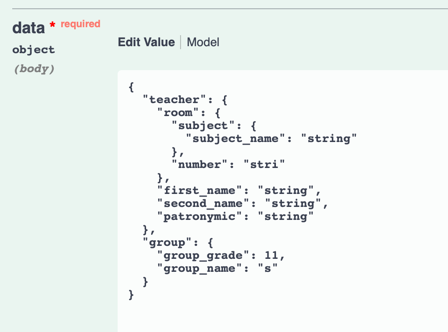
23 **Получить список учителей, преподающих те же предметы, что и учитель, ведущий
информатику в заданном классе.**
```
GET /school/teachers/colleagues
```
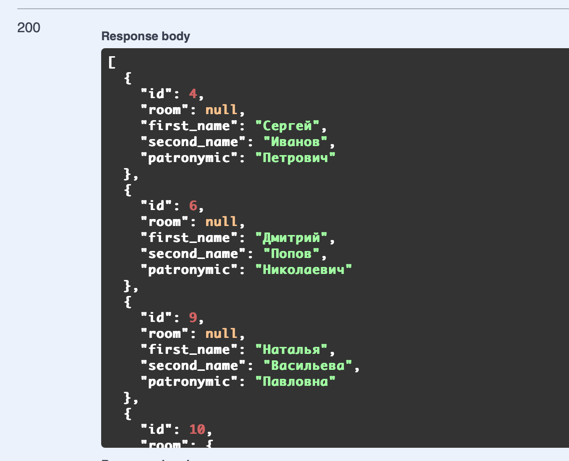
#### Rooms
24  **Получить количество аудиторий для базовых и профильных дисциплин**
```
GET /school/rooms/profile_base
```
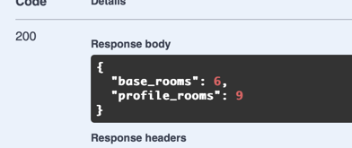
#### Subjects
25 **Получить список предметов и количество учителей, которые преподают дисциплину**
```
GET /school/subjects/teachers_count
```

#### Report
26 **Получить отчёт об определённом классе**
```
GET /school/report
```

### Auth
27 **Получить токен юзера по паролю и никнейму**
```
POST /auth/token/login
```
28 **Вывести информацию о пользователе**
```
GET /auth/users/me
```
29 **Зарегистрировать пользователя**
```
POST /auth/users
```

